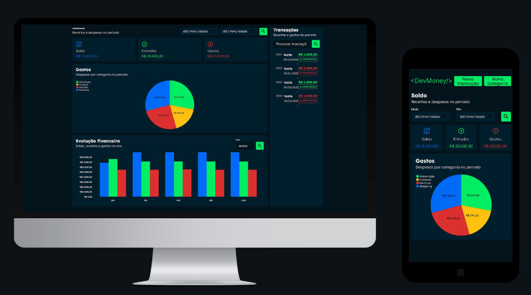

# DevMoney


<table>
  <tr>
    <td>
      
    </td>
  </tr>
</table>
<br />



> O Sistema de Controle Financeiro Pessoal é uma aplicação web desenvolvida com ênfase na experiência do usuário e praticidade. Ele oferece funcionalidades abrangentes para o gerenciamento financeiro pessoal, capacitando os usuários a registrar e monitorar transações, analisar padrões de comportamento ao longo do tempo e categorizar gastos para uma compreensão mais aprofundada dos hábitos financeiros. O sistema, com interface web front-end, inclui recursos como Registro de Transações, Acompanhamento de Saldo, Análise Temporal de Receitas e Despesas, Categorização de Despesas, Evolução Financeira Anual, Detalhes de Transações, Resumo de Receitas e Gastos Periódicos, além de uma Pesquisa Avançada para facilitar a navegação e a busca de informações específicas.

### Ajustes e melhorias

O projeto ainda está em desenvolvimento e as próximas atualizações serão voltadas nas seguintes tarefas:

- [x] Integração com API
- [x] Login e registro de usuário

## 💻 Pré-requisitos

Antes de começar, verifique se você atendeu aos seguintes requisitos:

- Você instalou a versão mais recente de `<linguagem / dependência / requeridos>`
- Você tem uma máquina `<Windows / Linux / Mac>`. Indique qual sistema operacional é compatível / não compatível.
- Você leu `<guia / link / documentação_relacionada_ao_projeto>`.

## 🚀 Instalando <devmoney-interface>

Para instalar o <devmoney-interface>, siga estas etapas:

Linux e macOS:

```
git@github.com:chrystophermedeiros/devmoney-interface.git
```

Windows:

```
git@github.com:chrystophermedeiros/devmoney-interface.git
```

## ☕ Usando <devmoney-interface>

Para usar <devmoney-interface>, siga estas etapas:

```
npm i
npm run dev
```


## 📫 Contribuindo para <devmoney-interface>

Para contribuir com <devmoney-interface>, siga estas etapas:

1. Bifurque este repositório.
2. Crie um branch: `git checkout -b <nome_branch>`.
3. Faça suas alterações e confirme-as: `git commit -m '<mensagem_commit>'`
4. Envie para o branch original: `git push origin <nome_do_projeto> / <local>`
5. Crie a solicitação de pull.

Como alternativa, consulte a documentação do GitHub em [como criar uma solicitação pull](https://help.github.com/en/github/collaborating-with-issues-and-pull-requests/creating-a-pull-request).

## 🤝 Colaboradores

Agradecemos às seguintes pessoas que contribuíram para este projeto:

<table>
  <tr>
    <td align="center">
      <a href="https://www.linkedin.com/in/chrystopher-medeiros/" title="Linkedin">
        <br>
        <sub>
          <b>Chrystopher Medeiros</b>
        </sub>
      </a>
    </td>
  </tr>
</table>

## 😄 Seja um dos contribuidores

Quer fazer parte desse projeto? Clique [AQUI](CONTRIBUTING.md) e leia como contribuir.

## 📝 Licença

Esse projeto está sob licença. Veja o arquivo [LICENÇA](LICENSE.md) para mais detalhes.
